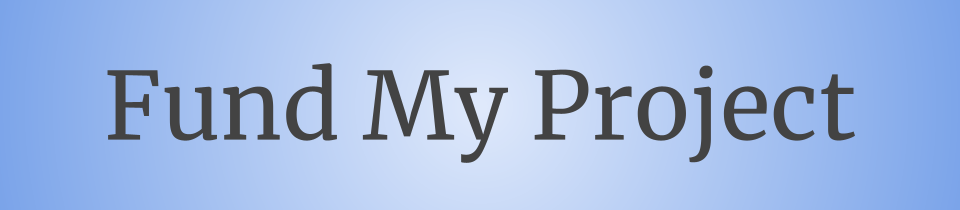

# FundMyProject
This project was developed for the Hackaton "Spacecamp by Terra Money"
https://eventornado.com/event/terra-spacecamp

The project's TLDR: a mix between Kickstarter and Patreon that executes on the Terra blockchain with minimal risk.

# NOTE

This project has been developed further in another repository.

If interested, contact this account.

## Using TestNet
The stored contracts are in Bombay-10:
- Investor Proxy
    - TX: [9C6A48D21933B8150B8562B47EC9A3CFB3FC948C9EA33DF63708FE5760BBBDD8](https://finder.terra.money/bombay-10/tx/9C6A48D21933B8150B8562B47EC9A3CFB3FC948C9EA33DF63708FE5760BBBDD8)
    - code_id: 9934
- Stake Manager
    - TX: [037C8C9FC483CA19707BFD8F43561FE878BE03A81A97F38675669D0FC14CED34](https://finder.terra.money/bombay-10/tx/037C8C9FC483CA19707BFD8F43561FE878BE03A81A97F38675669D0FC14CED34)
    - code_id: 9931
- Project Meta
    - TX: [0EEBEAC3D1D50093BF48E385F4D63BDF502B53B86F04AFBF7952C665094C2F98](https://finder.terra.money/bombay-10/tx/0EEBEAC3D1D50093BF48E385F4D63BDF502B53B86F04AFBF7952C665094C2F98)
    - code_id: 9932
- Project Token
    - TX: [37D3E9CBF381569E2767C266BA37FBF013457C76699A83F0A06AE2F3EFE41FD4](https://finder.terra.money/bombay-10/tx/37D3E9CBF381569E2767C266BA37FBF013457C76699A83F0A06AE2F3EFE41FD4)
    - code_id: 9933

# Future Work
- Add a ´beautiful´ Web3 interface
- Verify IPFS strings
- Support upload for Logo and Binary data
- Add verification for coins to token
- Add better logic for token minting
- Add logic to verify Project has achieved milestones in StakeManager
- Add a check to verify SM fund requests have at least 1000 blocks apart
- Add support for multiple currencies, currently only "uluna"
